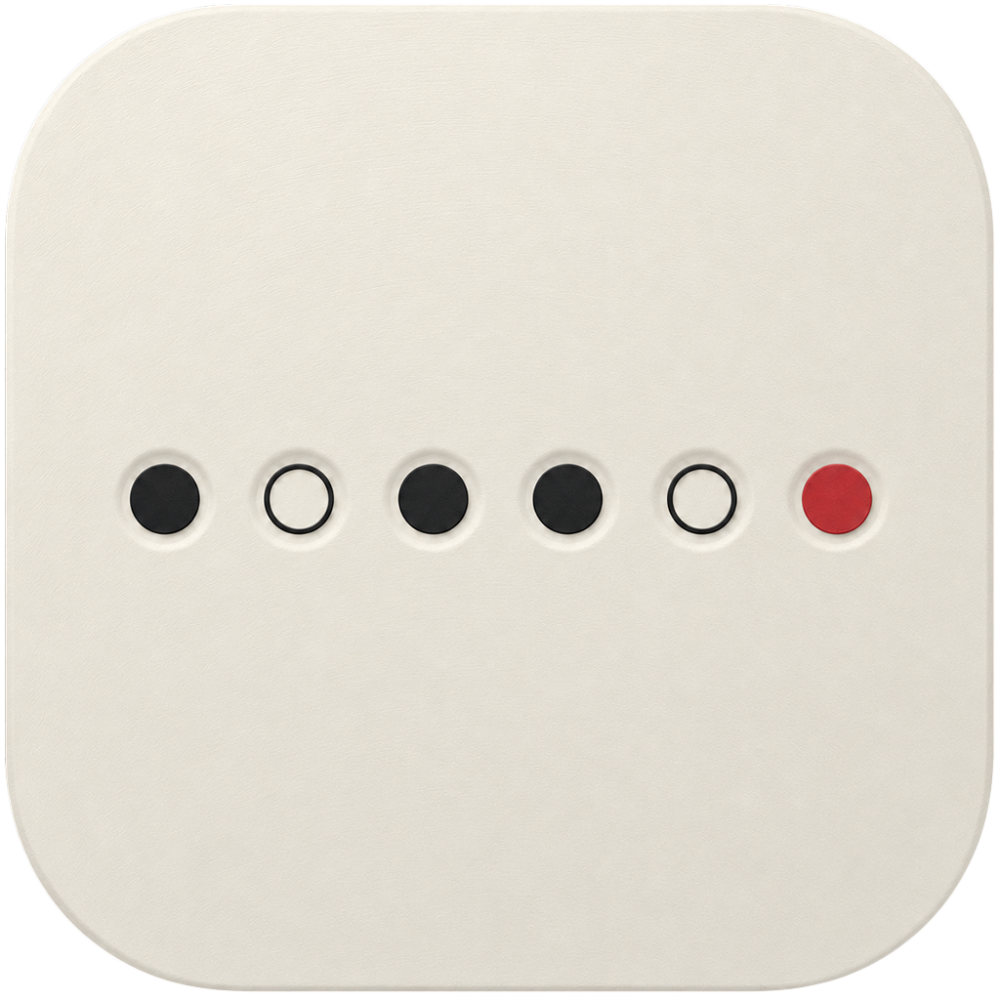

<p align="center">
  
</p>

<h1 align="center">Uncoded</h1>

<p align="center"><strong>Truthful lens metadata for Leica M shooters using third-party glass.</strong></p>

---

Leica M cameras identify lenses by a **6-bit code** on the bayonet mount.
Third-party lenses (Voigtländer, Zeiss, TTArtisan, 7Artisans, …) have no
official code, so photographers borrow a Leica one — and from then on every
DNG claims it was shot with a Leica lens, and Lightroom applies the wrong
correction profile.

Uncoded is a native macOS app that detects those lies and rewrites the
metadata with the truth.

## What it does

- **Scan** a folder of DNGs and see it as a **contact sheet** — thumbnails
  from the embedded previews, each frame stamped with the 6-bit code it
  claims, drawn as the physical pit pattern from the flange.
- **Your lenses, coded** — add a lens in one step: pick it from the Adobe
  lens-correction profiles already installed with Lightroom / Camera Raw on
  your Mac, and pick the code it wears (the plausible borrow is suggested
  first). The full community 6-bit code table ships in the app.
- **Manual overrides** — mark frames grease-pencil style and assign any
  lens directly: for adapted glass with no code, or days when one borrowed
  code served two lenses.
- **Fix** — one click rewrites lens make, model, focal length, and the
  Adobe lens-correction profile (`crs:LensProfile*`) so Lightroom shows
  your real lens with the right profile.

## Built to be trusted with your raws

- **No exiftool, no full-file rewrite.** A native TIFF/DNG engine reads
  only the few KB of metadata it needs (~1.5 ms per file) and writes
  **in place**: values are patched where they sit or appended at
  end-of-file with the directory entry re-pointed. Image data is never
  touched.
- **Every fix is undoable.** A byte-level journal records exactly what
  changed; *Revert Fix* restores the file **byte-for-byte** (verified by
  hash in the test suite). Journals survive app restarts.
- **`.bak` copies** (Settings, on by default): a one-time pristine sibling
  copy before the first fix ever touches a file.
- The writer is validated against ExifTool's field readout and
  `exiftool -validate` on real Leica M11 files.

## Requirements

- macOS 14 or later
- For the lens-profile picker: Adobe Lightroom / Camera Raw installed
  (Uncoded reads `/Library/Application Support/Adobe/CameraRaw/LensProfiles`)

## Install

Grab the `.dmg` from [Releases](../../releases), drag Uncoded to
Applications. Builds are currently **unsigned** — on first launch,
right-click the app → *Open* → *Open*.

## Build from source

```bash
brew install xcodegen
xcodegen generate
xcodebuild -scheme Uncoded -configuration Release build
```

Tests: `xcodebuild -scheme Uncoded test`

## Lightroom notes

- Lightroom reads a file's develop settings (including the lens profile)
  at **import**. For photos already in a catalog, use
  *Metadata → Read Metadata from File* after fixing.
- Fix first, import after, and everything just works.

## Heritage

Uncoded is the native successor of the
[fix_6bit_exif](https://github.com/arthursoares/fix_6bit_exif) CLI tool.

## Credits

- The community-maintained
  [Leica M 6-bit lens code spreadsheet](https://docs.google.com/spreadsheets/d/1Bx9L8IqhiQOc-jbGNaWn4rV-HRmf_zMHyHuLRkiO_FY/edit)
  — the code table bundled with the app is based on it.
- [ExifTool](https://exiftool.org) by Phil Harvey — the reference against
  which Uncoded's native metadata engine is validated.
- Adobe lens correction profiles are read from your local Lightroom /
  Camera Raw installation.

*Not affiliated with Leica Camera AG or Adobe Inc. Leica is a trademark of
Leica Camera AG; Lightroom and Camera Raw are trademarks of Adobe Inc.*
